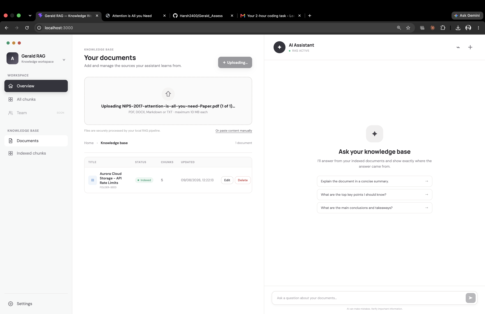
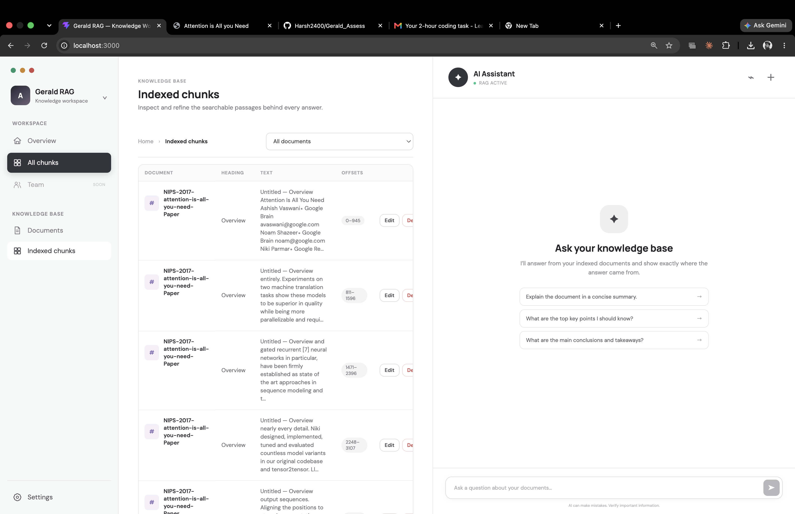
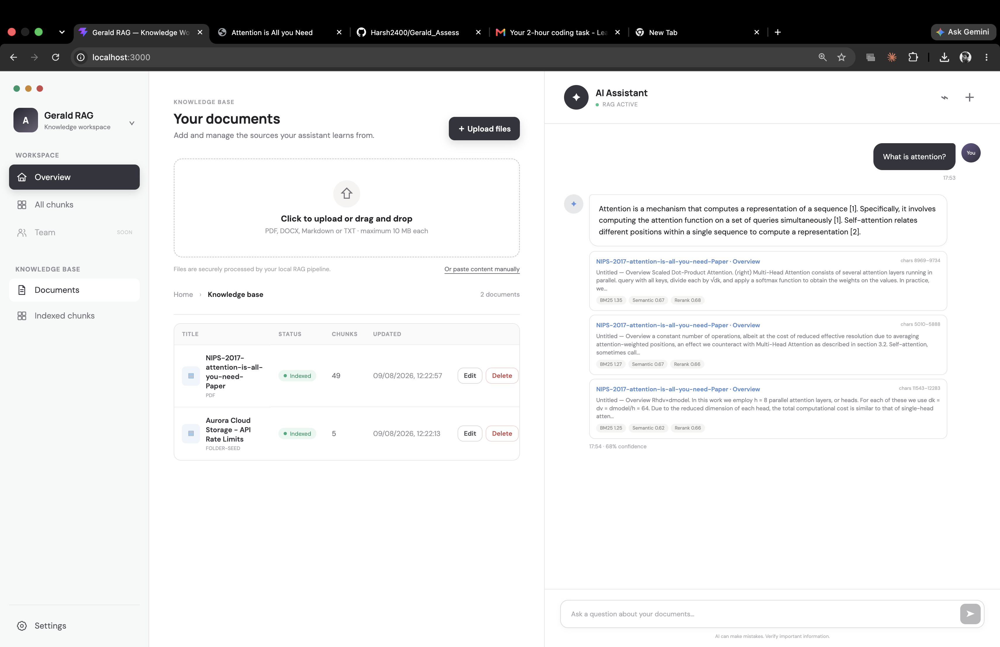

# Gerald RAG

Gerald RAG is a local-first knowledge assistant. Upload PDF, DOCX, Markdown, or
text files, then ask questions against their contents. Answers are generated by
Ollama and include citations, retrieval scores, and a confidence signal.

No cloud API key is required. Ollama runs directly on your computer so it can use
your native CPU/GPU acceleration; Docker runs the web app, API, and Qdrant.

## Screenshots

### Interface and document ingestion



### Indexed chunks



### Summary and grounded inference



## What is included

- React 19 + TypeScript frontend served by Nginx
- ASP.NET Core 8 API
- Local Ollama models for embeddings and answer generation
- Qdrant vector search
- In-process BM25 keyword search
- Reciprocal Rank Fusion and heuristic reranking
- SQLite document, chunk, and conversation persistence
- PDF, DOCX, Markdown, and TXT upload support
- Document/chunk CRUD, conversation history, citations, and confidence gating
- Docker Compose and GitHub Actions CI/CD

## Quick start

### 1. Install prerequisites

Install:

- [Docker Desktop](https://www.docker.com/products/docker-desktop/) or Docker
  Engine with the Compose plugin
- [Ollama](https://ollama.com/)
- Git

You do **not** need Node.js or the .NET SDK when using Docker Compose.

### 2. Start Ollama on your computer

Pull the two models Gerald RAG uses:

```bash
ollama pull nomic-embed-text:v1.5
ollama pull gemma3
```

The Ollama desktop application normally starts its server automatically. Verify it:

```bash
curl http://localhost:11434/api/tags
```

If that request fails, start the service manually:

```bash
ollama serve
```

On Linux, containers may need Ollama to listen beyond loopback. Start it with:

```bash
OLLAMA_HOST=0.0.0.0:11434 ollama serve
```

Only expose port `11434` on a trusted machine/network; Ollama does not provide
built-in authentication.

### 3. Clone and run Gerald RAG

```bash
git clone <your-repository-url>
cd gerald-rag
cp .env.example .env
docker compose up --build
```

Open [http://localhost:3000](http://localhost:3000).

The first startup builds the client and API images, starts Qdrant, creates the
SQLite database, creates the Qdrant collection, and indexes the sample documents.
Indexing calls your locally running Ollama instance, so keep Ollama running.

### 4. Use the app

1. Click **Upload files** or drag files onto the upload area.
2. Select one or more PDF, DOCX, Markdown, or TXT files, up to 10 MB each.
3. Wait until the documents show as indexed.
4. Ask a question in the assistant panel.
5. Expand citations to inspect the retrieved source passages and scores.

## Services and ports

| Component | Runs in | Default address | Purpose |
|---|---|---|---|
| Web app | Docker | `http://localhost:3000` | Gerald RAG UI and `/api` reverse proxy |
| API | Docker | `http://localhost:5252` | ASP.NET API; direct access is optional |
| Qdrant | Docker network only | `qdrant:6333/6334` | Vector storage and search |
| Ollama | Host computer | `http://localhost:11434` | Embeddings and generation |

The API container reaches host Ollama through `host.docker.internal`. Compose adds
the corresponding host-gateway mapping for Linux.

## Common commands

```bash
# Start in the foreground and display logs
docker compose up --build

# Start in the background
docker compose up --build -d

# View all logs
docker compose logs -f

# View only API logs
docker compose logs -f server

# Restart the app after a configuration change
docker compose restart server client

# Stop containers without deleting data
docker compose down

# Stop and permanently delete Gerald/Qdrant data
docker compose down -v
```

Do not use `docker compose down -v` unless you intend to delete uploaded documents,
conversations, SQLite data, and Qdrant vectors.

## Configuration

Copy `.env.example` to `.env` and adjust values if the defaults conflict with other
services:

```dotenv
GERALD_PORT=3000
GERALD_API_PORT=5252
OLLAMA_BASE_URL=http://host.docker.internal:11434
```

If Ollama runs on another computer, set `OLLAMA_BASE_URL` to a URL reachable from
the API container, for example `http://192.168.1.20:11434`. Ensure that host allows
connections from the Docker machine.

Model names, embedding dimensions, collection name, database path, and seed folder
are configured in `docker-compose.yml` under the `server` environment block.

## Local development without containerizing the app

Prerequisites:

- .NET 8 SDK
- Node.js 22+
- Docker for Qdrant
- Ollama running locally with both models pulled

From the repository root:

```bash
# Terminal 1: start a development Qdrant with host ports
# Skip this if Qdrant is already listening on localhost:6333/6334.
docker run --rm --name gerald-qdrant-dev \
  -p 6333:6333 -p 6334:6334 \
  -v gerald-qdrant-dev:/qdrant/storage \
  qdrant/qdrant:v1.15.4

# Terminal 2: start the API
cd server
dotnet restore
dotnet run

# Terminal 3: start Vite
cd client
npm ci
npm run dev
```

Open [http://localhost:5173](http://localhost:5173). Vite proxies `/api` requests to
`http://localhost:5252`.

For local development, the API reads `server/appsettings.json`, where Ollama and
Qdrant both use `localhost` addresses.

## Health checks

```bash
# Ollama on the host
curl http://localhost:11434/api/tags

# Gerald API
curl http://localhost:5252/healthz

# API through the frontend proxy
curl http://localhost:3000/api/documents

# Qdrant from inside its container
docker compose logs qdrant --tail=20
```

## Troubleshooting

### The API cannot connect to Ollama

Confirm Ollama works on the host:

```bash
curl http://localhost:11434/api/tags
ollama list
```

Then test connectivity from a temporary container:

```bash
docker run --rm --add-host=host.docker.internal:host-gateway \
  curlimages/curl:latest http://host.docker.internal:11434/api/tags
```

If host access fails on Linux, restart Ollama with
`OLLAMA_HOST=0.0.0.0:11434 ollama serve` and check the local firewall.

### A model is missing

```bash
ollama pull nomic-embed-text:v1.5
ollama pull gemma3
ollama list
```

The embedding model must remain `nomic-embed-text:v1.5` unless you also update the
configured embedding dimension and rebuild the Qdrant collection.

### The first request is slow

This is expected after Ollama starts. Loading a model into memory can add tens of
seconds to the first embedding or chat request. Warm requests are faster.

### Port already in use

Change the corresponding value in `.env`, then recreate the stack:

```bash
docker compose down
docker compose up --build
```

Qdrant is intentionally not published to host ports in the full Compose stack,
so an existing local Qdrant on `6333/6334` will not conflict with Gerald RAG.

### Vite reports `http proxy error` or `ECONNREFUSED`

Vite only runs the frontend. It proxies `/api` to `http://localhost:5252`, so the
ASP.NET API must be running in another terminal:

```bash
cd server
dotnet run
```

Verify it before refreshing the browser:

```bash
curl http://localhost:5252/healthz
```

Alternatively, stop Vite and use the complete Docker stack with
`docker compose up --build`, then open `http://localhost:3000` instead of port 5173.

### Uploaded files fail to index

- Confirm the file is PDF, DOCX, Markdown, or TXT and is 10 MB or smaller.
- Image-only/scanned PDFs do not contain extractable text; OCR is not included.
- Check `docker compose logs server` for Ollama or Qdrant connectivity errors.

### Reset all indexed data

```bash
docker compose down -v
docker compose up --build
```

This is destructive. It removes uploaded documents, conversations, and vector data.
It does not affect the Ollama models installed on your computer.

## Architecture

```text
Browser
  │
  ▼
Nginx client container ── /api ──► ASP.NET API container
                                      │
                 ┌────────────────────┼────────────────────┐
                 ▼                    ▼                    ▼
          SQLite volume       Qdrant container      Host Ollama
       docs/conversations       vector search     embed + generate
```

Document ingestion follows this path:

```text
upload → text extraction → Markdown normalization → chunking
       → Ollama embeddings → SQLite + Qdrant → BM25 refresh
```

Question answering runs BM25 and semantic retrieval, fuses their rankings with
Reciprocal Rank Fusion, reranks candidates, applies a confidence gate, and only then
asks Ollama to generate a grounded answer.

## Data persistence

Docker Compose creates two named volumes:

- `gerald_data`: SQLite documents, chunks, and conversations
- `qdrant_data`: vector embeddings and Qdrant collection state

Ollama models remain managed by the Ollama installation on your host computer.

## API overview

| Method | Route | Description |
|---|---|---|
| `GET` | `/healthz` | API health check |
| `GET` | `/api/documents` | List documents |
| `POST` | `/api/documents/upload` | Upload one multipart file using field `file` |
| `POST` | `/api/documents` | Create a document from JSON content |
| `PUT` | `/api/documents/{id}` | Replace and re-index a document |
| `DELETE` | `/api/documents/{id}` | Delete a document and its vectors |
| `GET` | `/api/chunks` | List or filter indexed chunks |
| `PUT` | `/api/chunks/{id}` | Edit and re-embed a chunk |
| `DELETE` | `/api/chunks/{id}` | Delete a chunk and its vector |
| `GET` | `/api/chat` | List conversations |
| `POST` | `/api/chat` | Start a conversation |
| `POST` | `/api/chat/{id}` | Continue a conversation |
| `POST` | `/api/ask` | Stateless question answering |

## CI/CD

`.github/workflows/ci-cd.yml` runs on pull requests and pushes to `main`:

1. Installs, lints, and builds the React client.
2. Restores and builds the ASP.NET API.
3. Builds both Docker images.
4. On `main`, publishes `gerald-rag-client` and `gerald-rag-server` images to GHCR.

The workflow uses `GITHUB_TOKEN`; no additional registry secret is required for
GitHub Container Registry publishing.

## Known limitations

- No authentication or multi-tenancy
- Scanned PDFs require OCR before upload
- Local-model response time depends on host hardware
- SQLite and Qdrant writes are not coordinated by a distributed transaction
- BM25 is rebuilt after writes and is intended for small-to-medium knowledge bases
- Follow-up questions are retrieved independently rather than rewritten with full
  conversation context
